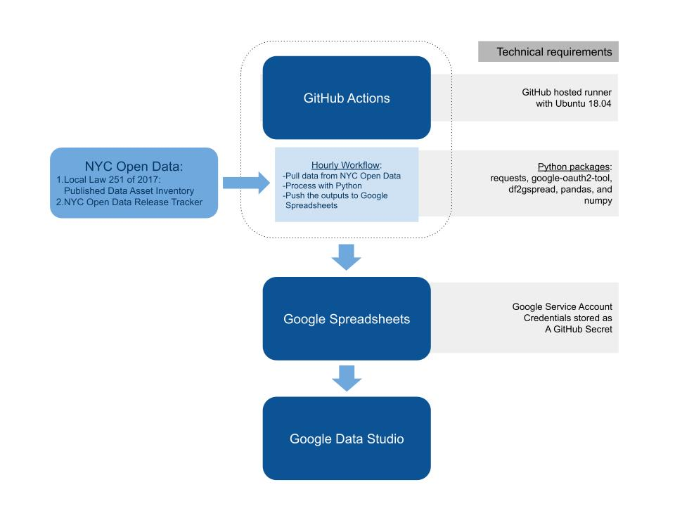

## Open Data Dashboard

### Repository Overview

This repository contains the full pipeline for updating and maintaining [NYC Open Data Dashboard](https://datastudio.google.com/reporting/69d85d4d-4d5a-486a-87ee-c3b5ec31f527) (requires permissions).

Files in this repository:

> `dashboard_prod.py` - main script executed hourly through GitHub Actions.

> `dashboard_dev.py` - a copy of the main script for testing, executed hourly through GitHub Actions.

> `credentials.py` - supplemental module, called within main script. Contains helper functions to call Socrata and Google Sheets APIs. Does not contain any actual credentials. All credentials are stored as GitHub secrets.

> `requirements.txt` - `python3` requirements for the dashboard script to run. 

> `.github/workflows/dashboard.yml` - GitHub Actions workflow file.

### Technical Requirements

#### Infrastructure 

The infrastructure of the dashboard relies entirely on tools available to public at no cost (if used within allocated limits):

- GitHub Actions
- Google Spreadsheets and Google Data Studio

[GitHub Actions](https://docs.github.com/en/actions) allow users to automate, customize, and execute workflows within a repository. There is no need to have access to special hardware or cloud infrastructure outside GitHub. 

_Implementation tip:_ To set up a simple workflow, similar to the Open Data Dashboard, user needs to create [a workflow file](https://docs.github.com/en/actions/learn-github-actions/introduction-to-github-actions#create-an-example-workflow) within their repository to initiate and run the process. [`.github/workflows/dashboard.yml`](https://github.com/MODA-NYC/OpenDataDashboard_v3/blob/master/.github/workflows/dashboard.yml) is the workflow file for the Open Data Dashboard.

[Google Spreadsheets](https://docs.google.com/spreadsheets/u/0/) and [Google Data Studio](https://datastudio.google.com/u/0/) are free tools avaialble to all users with a Google account. 

_Implementation tip:_ To establish communication between the processes within a GitHub Actions workflow and Google applications, user needs to retreive their own Service Account credentials from Google API. You can use [these instructions](https://docs.gspread.org/en/latest/oauth2.html#for-bots-using-service-account) to retreive credentials associated with your Google account (we use `gspread` Python package to establish the connection in our pipeline). We store our credentials as [GitHub Secrets](https://docs.github.com/en/actions/reference/encrypted-secrets), which is a good practice for storing any sensitive information stored on GitHub. 

#### Data

All metrics in the dashboard are derived from two public datasets available on [Open Data NYC](https://opendata.cityofnewyork.us/data/):

1. [Local Law 251 of 2017: Published Data Asset Inventory](https://data.cityofnewyork.us/City-Government/Local-Law-251-of-2017-Published-Data-Asset-Invento/5tqd-u88y)
2. [NYC Open Data Release Tracker](https://data.cityofnewyork.us/City-Government/NYC-Open-Data-Release-Tracker/qj2z-ibhs)

#### Technical Knowledge

Some `Python` knowledge would be helpful if user wants to understand how the metrics are derived in [the main script](https://github.com/MODA-NYC/OpenDataDashboard_v3/blob/master/dashboard_prod.py). However, there is no need to install `Python` on user's local machine as all the processing is performed on a [GitHub-hosted runner](https://docs.github.com/en/actions/using-github-hosted-runners/about-github-hosted-runners). 
General familiarity with GitHub is necessary if user wants to replicate this process within their own GitHub/Google accounts by forking the repo. 

### Workflow Overview

The diagram below provides an overall view of the Open Data Dashboard pipeline.

